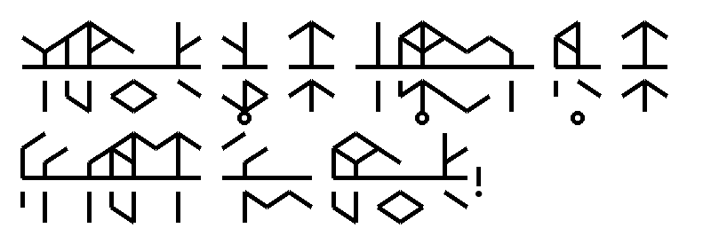

# pytrunic
A python library for Trunic translation and script generation

## Overview

"Trunic" is the fictional writing system of the video game Tunic ([https://tunicgame.com/](https://tunicgame.com/)). Pytrunic is a light-weight, python-only library for rendering Trunic script from phonetic English strings.

For more on Trunic, see:
[https://www.thegamer.com/meaning-of-tunic-mysterious-language-andrew-shouldice/](https://www.thegamer.com/meaning-of-tunic-mysterious-language-andrew-shouldice/)
[https://www.reddit.com/r/TunicGame/comments/tgc056/tunic_language_reference_sheet_big_spoiler/](https://www.reddit.com/r/TunicGame/comments/tgc056/tunic_language_reference_sheet_big_spoiler/)

Trunic text is composed of "Trunes", each encoding a consonant/vowel pair of phonemes: multiple trunes are strung together to forms words. Example of Trunic text:

Phonetic translation: "t-roo-ni-k iz thzah l-ang-wi-ch ov thzah po-p-yoo-lah gay-m too-ni-k!"

English translation: "Trunic is the language of the popular game Tunic!"

## Usage
See "pytrunic_example.py":

    # create object to render Trunic
    trunic = Trunic(size=50, textcolour=(0,0,0))
    
    # Example sentence written in phoneme pairs
    sentence1 = 'doo yoo fear thzah iez ov thzah far shaw?'
    sentence2 = 't-roo-ni-k iz thzah l-ang-wi-ch ov thzah po-p-yoo-lah gay-m too-ni-k!'
    
    # Display in Trunic
    trunic.display(sentence1)
    
    # export out to file
    trunic.export(sentence2, 'example_out001.png')

## Notes on text strings and phonemes
I ended up using my own style of phonemes (see examples below). Each trune is specified by a combination of (up to two) phonemes (one consontant, one vowel in pronounced order), with individual trunes separated by a hyphen within a given word. Spaces between words. Accepts the punctuation . , ! and ?.

## Consonant phonemes:
* 'b' as in **b**ack.
* 'ch' as in **ch**icken.
* 'd' as in **d**og.
* 'f' as in **f**ox.
* 'g' as in **g**ood or **g**ame.
* 'h' as in **h**elp.
* 'j' as in **j**uice or **g**esture.
* 'k' as in **k**ilometer or **c**at.
* 'l' as in **l**ion.
* 'm' as in **m**an.
* 'n' as in **n**ew.
* 'ng' as in so**ng** or doi**ng**.
* 'p' as in **p**rince or **p**et.
* 'r' as in **r**obe or **r**at.
* 's' as in **s**un.
* 'sh' as in **sh**ore or **s**ure or mi**ss**ion.
* 't' as in **t**ype.
* 'th' as in ba**th** or pa**th**.
* 'thz' as in **th**is or **th**at or ba**th**e (at first seems similar to 'th', but has a bit of a 'z' sound in it). 
* 'v' as in **v**ery.
* 'w' as in **w**ater.
* 'y' as in **y**olk.
* 'z' as in **z**ebra.
* 'zh' as in vi**s**ion or preci**s**ion.

## Vowel phonemes:
* 'a' as in **a**pple.
* 'ar' as in **ar**t or p**ar**t (the 'r' usually rolls over into the next phoneme).
* 'o' as in h**o**t.
* 'ay' as in d**ay** or pl**ay**.
* 'e' as in b**e**t or p**e**t.
* 'ee' as in b**ee** or f**ee**t.
* 'ear' as in f**ear** or cl**ear**.
* 'ah' as in b**a**th or f**a**ther (similar to 'ar' but without the 'r' sound).
* 'air' as in f**air** or **heir**.
* 'i' as in b**i**g or w**i**th.
* 'ie' as in d**ie** or fl**y**.
* 'er' as in **ear**th or wat**er**.
* 'oh' as in **oh**ms or f**oe**.
* 'oi' as in t**oy** or t**oi**let.
* 'oo' as in m**oo**d or r**u**de.
* 'ou' as in l**oo**k or w**o**lf.
* 'ow' as in h**ow** or p**ow**der.
* 'aw' as in p**aw** or p**our** or t**or**n.
